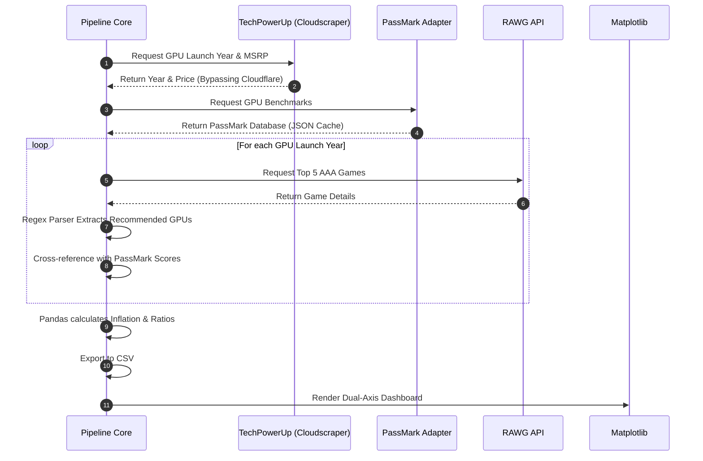

📈 Performance Inflation
======================

> An automated data science and web scraping pipeline that measures the real perceived value of PC hardware over time by cross-referencing raw GPU benchmarks, inflation-adjusted MSRPs, and the escalating system requirements of AAA games.

## 📖 About
**Performance Inflation** is an analytical tool built to answer a recurring question in the PC gaming community: *"Is hardware getting more expensive, or are games just getting heavier?"* Instead of relying on nostalgia or hardware marketing, this script autonomously fetches real-world data from multiple APIs and databases (RAWG, PassMark, TechPowerUp) to build a historical timeline. It estimates the **effective gaming headroom** of a GPU generation by penalizing raw benchmark power with the rising system requirements of modern AAA titles.

---

## 📸 Dashboard Preview


---

## 🎯 Core Thesis — Demand-Adjusted Performance

The central idea behind this project is the **Demand-Adjusted Performance** metric, represented by the **Orange Circle** in the top chart.

* **Orange Circle (Demand-Adjusted Performance):** The effective power of a GPU once the increasing computational demand of modern AAA game engines is taken into account. If this line trends downward across generations, it means that although GPUs are becoming faster in absolute terms, they provide **less long-term graphical headroom** for running contemporary games.

*(The detailed mathematical formulation for this metric is explained in the **Mathematics** section.)*

### Why this metric matters

Most gamers do not upgrade their GPU to dramatically increase visual quality. In practice, upgrades are often performed to **maintain roughly the same experience** — for example, continuing to run new AAA releases at similar graphics settings and framerates as previous generations.

In other words, hardware upgrades are frequently used to **preserve a performance baseline**, not necessarily to raise it.

This creates an important question:

> *Are GPUs actually improving the player's long-term ability to run new games, or are game engines consuming performance faster than hardware evolves?*

The **Demand-Adjusted Performance** metric attempts to quantify this relationship.

By penalizing the raw benchmark score of a GPU with the increasing average hardware requirements of modern AAA titles, the model estimates the **effective performance headroom** that a new generation provides relative to the previous one.

### What the data suggests

The dataset shows a clear pattern:

- **Raw GPU power increases dramatically across generations.**
- **Performance per dollar also improves significantly.**
- However, **Demand-Adjusted Performance grows much more slowly and even declines after certain generations.**

This indicates that while silicon manufacturing and GPU architectures continue to improve, 

> ***but Game engines and graphical expectations are absorbing a large portion of the performance gains delivered by modern GPUs.***

The result is a subtle but noticeable phenomenon experienced by many PC gamers:

> New GPUs are objectively faster, but they often provide **less long-term breathing room** for future games than earlier generations did.

This project attempts to make that phenomenon measurable.

---

## 📊 Chart Lines Breakdown
The generated dashboard contains two subplots to separate the graphical narrative from the economic narrative:

**Top Chart: Performance vs. Game Engine Demand**
* **Cyan Triangle (Raw Hardware Power):** The marketing numbers. The total PassMark G3D Mark score the GPU achieves.
* **Red Cross (Avg. Recommended Requirements):** The average PassMark score required to run the top 5 most popular AAA games of that year.
* **Orange Circle (Demand-Adjusted Performance):** The reality. The raw power penalized by the engine demand. If this line goes down, you are experiencing less graphical longevity than the previous generation.

**Bottom Chart: Hardware Economy (Price vs. Value)**
* **Green Diamond (Inflation-Adjusted Price):** The real cost of the GPU in modern USD.
* **Purple Square (Performance per Dollar):** The hardware efficiency. If this line goes up, silicon manufacturing is still advancing and offering more calculations for your money.

---

## 🧮 The Mathematics (Formulas)
To prevent the chart scales from clashing and to ensure economic accuracy, the script applies the following calculations dynamically:

### Inflation-Adjusted Price
Converts the historical launch MSRP into modern-day purchasing power using the US Consumer Price Index (CPI).
$$Price_{Adjusted}=Price_{MSRP}\times\left(\frac{CPI_{2024}}{CPI_{LaunchYear}}\right)$$

### Engine Inflation Factor
Calculates how much heavier AAA games have become compared to the base year (the first year in the dataset).
$$Factor_{Inflation}=\frac{Demand_{Year}}{Demand_{BaseYear}}$$
(DemandYear = average PassMark score of recommended GPUs for the top AAA games released in that year)

### Real Perceived Performance (Adjusted Power)
The core metric of the project. It penalizes the raw hardware power based on how much heavier the games have become, representing what the user actually *feels* when playing.
$$Power_{Adjusted}=\frac{Power_{Raw}}{Factor_{Inflation}}$$

### Performance per Dollar
The true measure of silicon value. Measures how many benchmark points you buy with a single dollar, adjusted for inflation.
$$Ratio=\frac{Power_{Raw}}{Price_{Adjusted}}$$

---

## 🧩 Processing Pipeline
The following flowchart illustrates the autonomous data gathering and transformation lifecycle.



* * * * *

🧠 Key Insights & Discoveries
--------------------------------

By running the pipeline on the NVIDIA 60-Series (from GTX 960 to RTX 5060), the data reveals a few undeniable market truths:

### The RTX 2060 "Future Tax" Anomaly

Historically, upgrading to a new generation yielded a massive spike in *Performance per Dollar* (e.g., +32% from the 960 to the 1060). However, the RTX 2060 broke this trend. While it delivered a massive ~40% raw performance leap, NVIDIA increased its inflation-adjusted price by ~31.5%. As a result, the *Performance per Dollar* metric stagnated. The data proves that NVIDIA absorbed almost the entire technological leap of Moore's Law as a profit margin, charging a premium for early Ray Tracing and DLSS tech.

<p align="center">

</p>

### The Illusion of Cheaper Hardware

Looking at nominal prices, the RTX 4060 and 5060 launched at a cheaper MSRP ($299) than the RTX 2060 ($349). Adjusted for US inflation, the hardware itself is actually getting *cheaper* in real purchasing power.

### Moore's Law is Alive, Optimization is Dead

If hardware is cheaper and mathematically faster (giving you more raw score per dollar), why does upgrading feel so unrewarding today? The **Adjusted Power** metric reveals the truth: game engines are devouring performance faster than hardware evolves. You pay less today for a mathematically superior GPU, but it gives you a smaller "breathing room" to run modern AAA games than a GTX 1060 gave you in 2016.

* * * * *

🛠 Tech Stack
----------------

-   **Language:** Python 3

-   **Data Manipulation:** Pandas

-   **Web Scraping & Anti-Bot:** Cloudscraper, BeautifulSoup4 (bs4), Regular Expressions (re)

-   **APIs:** RAWG.io Video Games Database

-   **Economics:** CPI-U (Consumer Price Index for All Urban Consumers) data library

-   **Visualization:** Matplotlib

* * * * *

⚙️ Installation & Run
------------------------

### 🚀 Setup Instructions

1.  **Clone the repository:**

    Bash

    ```
    git clone https://github.com/g-brrzzn/PerformanceInflation
    cd PerformanceInflation

    ```

2.  **Install the dependencies:**

    Bash

    ```
    pip install -r requirements.txt

    ```

3.  **Configure your API Key:** Open `config.py` and replace the placeholder with your free API key from [RAWG.io](https://rawg.io/apidocs):

    Python

    ```
    RAWG_API_KEY = "your_api_key_here"

    ```

4.  **Run the analysis:**

    Bash

    ```
    python main.py

    ```

    *Note: The first execution might take a minute as the `cpi` library downloads the latest US government inflation databases and the scrapers build your local JSON caches.*

### 🎛️ Customization

You can analyze different GPU tiers by simply changing the `CHOSEN_SERIES` variable inside `config.py` (e.g., set it to `'70'` to analyze the High-End 70-Series tier). The entire pipeline will adapt automatically!
